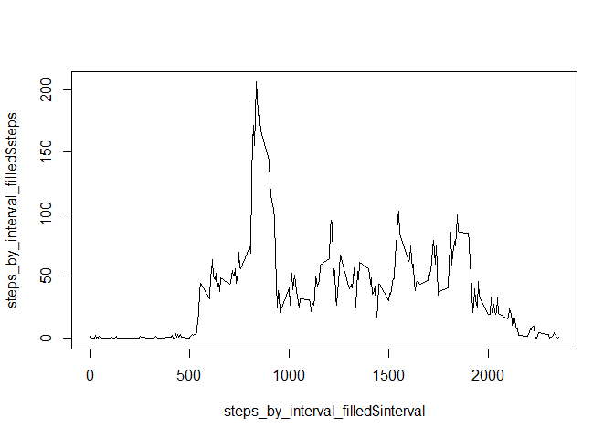

Loading and preprocessing the data
----------------------------------

``` r
activity<-read.csv("activity.csv")
```

What is mean total number of steps taken per day?
-------------------------------------------------

``` r
steps_sum<-aggregate(steps~date,data=activity,FUN="sum")
hist(steps_sum$steps)
```


``` r
summary(steps_sum$steps)
```

    ##    Min. 1st Qu.  Median    Mean 3rd Qu.    Max. 
    ##      41    8841   10760   10770   13290   21190

What is the average daily activity pattern?
-------------------------------------------

``` r
steps_by_interval<-aggregate(steps~interval,data=activity,FUN="mean")
plot(steps_by_interval$interval,steps_by_interval$steps,pch=c(0),type="l")
```


``` r
steps_by_interval$interval[which.max(steps_by_interval$steps)]
```

    ## [1] 835

Imputing missing values
-----------------------

``` r
library(plyr)
str(activity[is.na(activity$steps),] )
```

    ## 'data.frame':    2304 obs. of  3 variables:
    ##  $ steps   : int  NA NA NA NA NA NA NA NA NA NA ...
    ##  $ date    : Factor w/ 61 levels "2012-10-01","2012-10-02",..: 1 1 1 1 1 1 1 1 1 1 ...
    ##  $ interval: int  0 5 10 15 20 25 30 35 40 45 ...

``` r
impute.mean <- function(x) replace(x, is.na(x), mean(x, na.rm = TRUE))
activity_filled <- ddply(activity, ~ interval, transform, steps = impute.mean(steps))
steps_by_interval_filled<-aggregate(steps~interval,data=activity_filled,FUN="mean")
plot(steps_by_interval_filled$interval,steps_by_interval_filled$steps,pch=c(0),type="l")
```



``` r
steps_by_interval_filled<-aggregate(steps~interval,data=activity_filled,FUN="median")
plot(steps_by_interval_filled$interval,steps_by_interval_filled$steps,pch=c(0),type="l")
```


``` r
steps_by_interval<-aggregate(steps~interval,data=activity,FUN="median")
plot(steps_by_interval$interval,steps_by_interval$steps,pch=c(0),type="l")
```


 \#\# Are there differences in activity patterns between weekdays and weekends?

``` r
activity_filled$daytype=ifelse(weekdays(as.Date(activity_filled$date))=="星期六"|weekdays(as.Date(activity_filled$date))=="星期日","weekends", "weekdays")
activity_filled$daytype=as.factor(activity_filled$daytype)
activity_filled_weekday<-activity_filled[activity_filled$daytype=="weekdays",]
activity_filled_weekend<-activity_filled[activity_filled$daytype=="weekends",]
par(mfrow=c(2,1))
activity_filled_weekend_aggr=aggregate(steps~interval,data=activity_filled_weekend,FUN="mean")
plot(activity_filled_weekend_aggr$interval,activity_filled_weekend_aggr$steps,pch=c(0),type="l")

activity_filled_weekday=aggregate(steps~interval,data=activity_filled_weekday,FUN="mean")
plot(activity_filled_weekday$interval,activity_filled_weekday$steps,pch=c(0),type="l")
```


